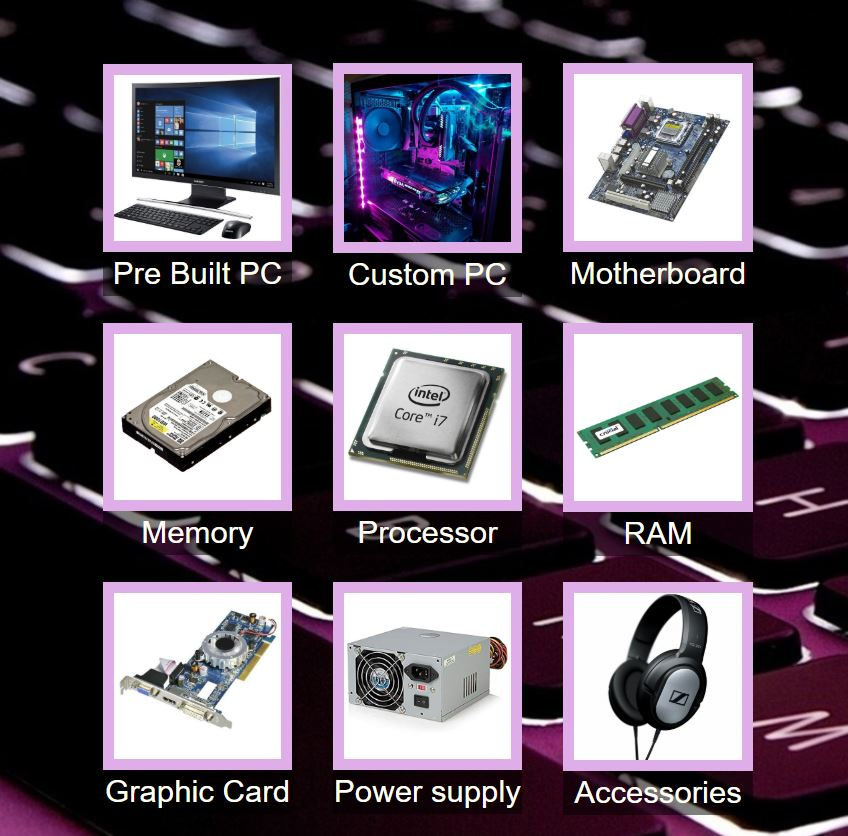
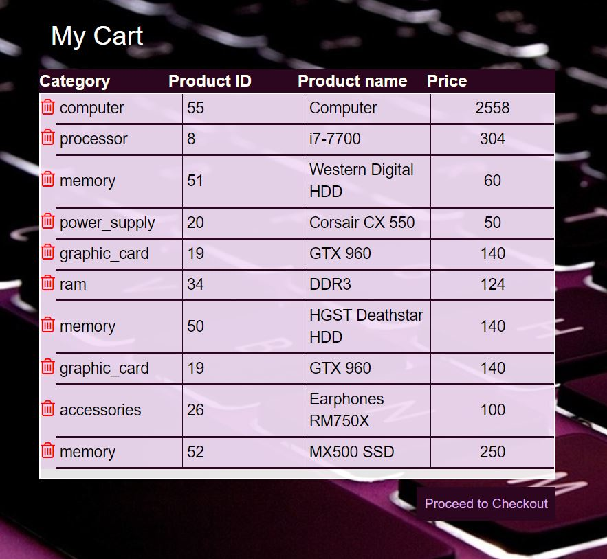
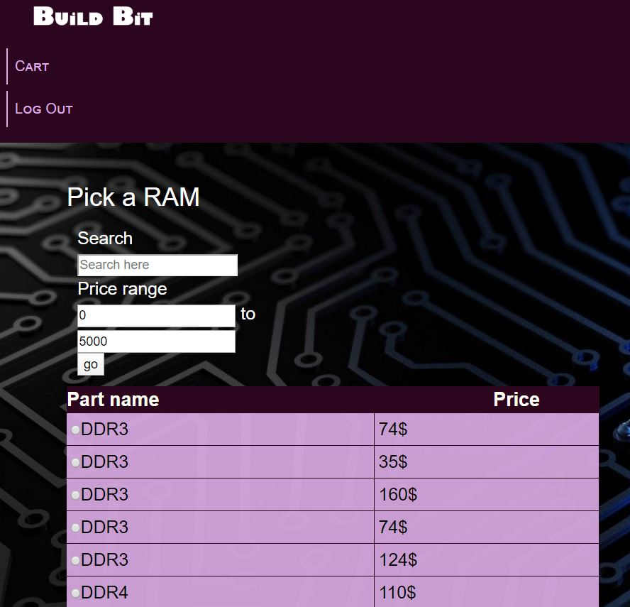

# Build-Bit


# Getting Started 
Run wamp server and clone the repository to "www" directory of wamp. Enter the link "localhost\index.php" in your broswer and start exploring the website. 

# Get
```
git clone https://github.com/roshnaeem/Build-Bit-Website.git
```

# Built With
<ul>
<li>HTML</li>
<li>CSS</li>
<li>PHP</li>
<li>SQL</li>
<li>JavaScript</li>
<li>AJAX</li>
<li>Angular JS</li>
<li>jQuery</li>
</ul>


# Website Pages 

<table>
<tr>
<td>  </td>
<td>  </td>
<td>  </td>
</tr>

<tr>
<td>  </td>
<td>  </td>
<td>  </td>
</tr>


</table>
